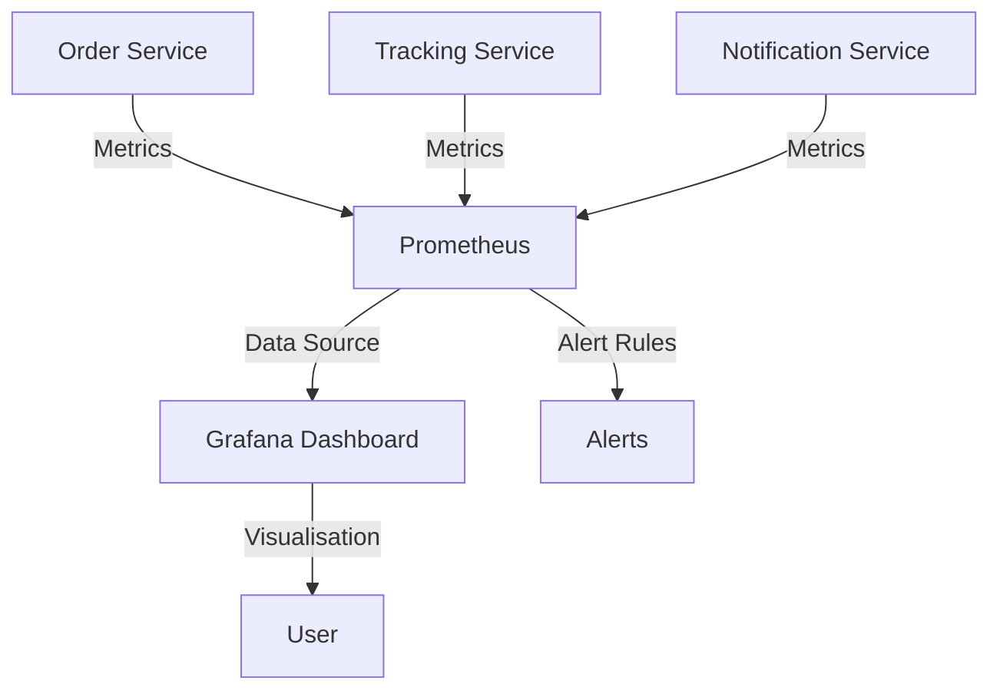

# WatchTower — Observability Setup

## Overview

In this project, I set up a complete observability system for three backend services:

* order-service
* tracking-service
* notification-service

The goal was to make it easy to:

* monitor system activity
* visualize metrics
* detect issues early using alerts

---

## Architecture

The system works like this:

Services → Prometheus → Grafana → Alerts

* Each service exposes `/metrics`
* Prometheus collects metrics every 15 seconds
* Grafana shows dashboards based on those metrics
* Prometheus alert rules detect failures

---

## Architecture Diagram



---

## How to Run

From the WatchTower folder:

```bash
docker compose up --build
```

---

## How to Verify

### Services

* http://localhost:3001/health
* http://localhost:3002/health
* http://localhost:3003/health

All should return:

```json
{ "status": "ok" }
```

---

### Prometheus

Open:

```
http://localhost:9090
```

Check:

```
/targets
```

All services should show **UP**

---

### Grafana

Open:

```
http://localhost:3000
```

Login:

```
username: admin
password: admin
```

Then go to:

```
Dashboards → Browse → WatchTower
```

You will see:

```
WatchTower Service Overview
```

---

## Dashboard Panels

The dashboard includes:

### 1. HTTP Request Rate

Shows how many requests each service receives per second

### 2. Error Rate (5xx)

Shows how many server errors happen over time

### 3. Service Health

Shows if each service is UP or DOWN

---

## Alert Rules

Defined in `prometheus/alerts.yml`

### ServiceDown

* Trigger: service is down for 1 minute
* Severity: critical

### HighErrorRate

* Trigger: more than 5% of requests fail
* Severity: warning

### ServiceNotScraping

* Trigger: Prometheus cannot scrape service for 2 minutes
* Severity: warning

---

## How I Tested Alerts

I stopped one service:

```bash
docker stop order-service
```

Then checked:

```
http://localhost:9090/alerts
```

Result:

* ServiceDown → FIRING
* ServiceNotScraping → FIRING

Then restarted:

```bash
docker start order-service
```

Service returned to normal.

---

## Logs

### View logs from all services

```bash
docker compose logs -f order-service tracking-service notification-service
```

Example output:

```
order-service         | {"level":"info","service":"order-service","msg":"Listening on port 3001"}
tracking-service      | {"level":"info","service":"tracking-service","msg":"Listening on port 3002"}
notification-service  | {"level":"info","service":"notification-service","msg":"Listening on port 3003"}
```

---

### Filter only error logs

```bash
docker compose logs order-service | Select-String '"level":"error"'
```

Example output:

```
(no output if no errors are present)
```

---

## Bonus Work

I added an uptime graph to the Grafana dashboard.

### Uptime Graph

This panel shows the uptime percentage of each service over the last 24 hours.

---
## Notes

* All configuration is handled using environment variables
* `.env` is ignored and not committed
* `.env.example` is provided for reference
* Docker network allows services to communicate using service names

---
